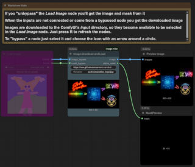
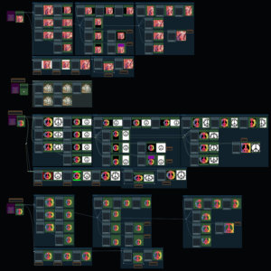

# ComfyUI Image Miscellaneous Nodes &#x0001f3a8;

This repository provides a set of custom nodes for ComfyUI focused on image manipulation.
Currently we just have a few nodes used by other nodes I maintain.


## &#x2699;&#xFE0F; Main features

&#x2705; No bizarre extra dependencies, we use the same modules as ComfyUI

&#x2705; Warnings and errors visible in the browser, configurable debug information in the console


## &#x0001F4DC; Table of Contents

- &#x0001F680; [Installation](#-installation)
- &#x0001F4E6; [Dependencies](#-dependencies)
- &#x0001F5BC;&#xFE0F; [Examples](#&#xFE0F;-examples)
- &#x2728; [Nodes](#-extra-nodes)
  - Foreground: (Foreground estimation)
    - [Estimate foreground (AFFCE)](docs/nodes_img.md#8-estimate-foreground-affce)
    - [Estimate foreground (FMLFE)](docs/nodes_img.md#9-estimate-foreground-fmlfe)
  - Generation:
    - [Create Empty Image](docs/nodes_img.md#10-create-empty-image)
  - Input/Output:
    - [Image Download and Load](docs/nodes_img.md#1-image-download-and-load)
  - Manipulation:
    - [Face Composite](docs/nodes_img.md#2-face-composite)
    - [Face Composite (frame by frame)](docs/nodes_img.md#3-face-composite-frame-by-frame)
    - [Apply Mask using AFFCE](docs/nodes_img.md#7-apply-mask-using-affce)
    - [Pad Image](docs/nodes_img.md#11-pad-image-kjset)
    - [Resize Image](docs/nodes_img.md#12-resize-image-kjset)
    - [Resize Mask](docs/nodes_img.md#13-resize-mask-kjset)
  - Normalization:
    - [Normalize Image to ImageNet](docs/nodes_img.md#4-normalize-image-to-imagenet)
    - [Normalize Image to [-0.5, 0.5]](docs/nodes_img.md#5-normalize-image-to-05-05)
    - [Normalize Image to [-1, 1]](docs/nodes_img.md#6-normalize-image-to-1-1)
- &#x0001F4DD; [Usage Notes](#-usage-notes)
- &#x0001F4DC; [Project History](#-project-history)
- &#x2696;&#xFE0F; [License](#&#xFE0F;-license)
- &#x0001F64F; [Attributions](#-attributions)

## &#x2728; Nodes

The nodes are documented [here](docs/nodes_img.md). Use the above ToC to access them by category.

## &#x0001F680; Installation

You can install the nodes from the ComfyUI nodes manager, the name is *Image Misc*, or just do it manually:

1.  Clone this repository into your `ComfyUI/custom_nodes/` directory:
    ```bash
    cd ComfyUI/custom_nodes/
    git clone https://github.com/set-soft/ComfyUI-ImageMisc ComfyUI-ImageMisc
    ```
2.  Install dependencies: `pip install -r ComfyUI/custom_nodes/ComfyUI-ImageMisc/requirements.txt`
3.  Restart ComfyUI.

The nodes should then appear under the "image/io", "image/manipulation", "image/normalization" and "image/foreground" categories in the "Add Node" menu.


## &#x0001F4E6; Dependencies

- SeCoNoHe (seconohe): This is just some functionality I wrote shared by my nodes, only depends on ComfyUI.
- PyTorch: Installed by ComfyUI
- NumPy: Installed by ComfyUI
- Pillow: Installed by ComfyUI
- Requests (optional): Usually an indirect ComfyUI dependency. If installed it will be used for downloads, it should be more robust than then built-in `urllib`, used as fallback.
- Colorama (optional): Might help to get colored log messages on some terminals. We use ANSI escape sequences when it isn't installed.


## &#x0001F5BC;&#xFE0F; Examples

Once installed the examples are available in the ComfyUI workflow templates, in the *Image Misc* section (or ComfyUI-ImageMisc).

### [image_download.json](https://raw.githubusercontent.com/set-soft/ComfyUI-ImageMisc/refs/heads/main/example_workflows/image_download.json)

[](https://raw.githubusercontent.com/set-soft/ComfyUI-ImageMisc/refs/heads/main/example_workflows/image_download.json)

Shows how to use the image downloader node.


### [resize.json](https://raw.githubusercontent.com/set-soft/ComfyUI-ImageMisc/refs/heads/main/example_workflows/resize.json)

[](https://raw.githubusercontent.com/set-soft/ComfyUI-ImageMisc/refs/heads/main/example_workflows/resize.json) :

Shows the most common uses of the resize and padding nodes. You can see how various modes and options affects the result and how the different interpolation methods works. It shows how masks and RGBA images are handled.


## &#x0001F4DD; Usage Notes

- **Logging:** &#x0001F50A; The nodes use Python's `logging` module. Debug messages can be helpful for understanding the transformations being applied.
  You can control log verbosity through ComfyUI's startup arguments (e.g., `--preview-method auto --verbose DEBUG` for more detailed ComfyUI logs
  which might also affect custom node loggers if they are configured to inherit levels). The logger name used is "ImageMisc".
  You can force debugging level for these nodes defining the `IMAGEMISC_NODES_DEBUG` environment variable to `1`.


## &#x0001F4DC; Project History

- 1.0.0 2025-07-21: Initial release
  - Just the download image.
- 1.1.0 2025-07-25: Adapted to use SeCoNoHe
- 1.1.1 2025-07-25: Just small details for ComfyUI registry
- 1.2.0 2025-10-05:
  - Face composite nodes
  - Normalization nodes
  - Apply mask nodes, including support for:
    - "Fast Multi-Level Foreground Estimation" (from [PyMatting](https://github.com/pymatting/pymatting))
    - "Approximate Fast Foreground Colour Estimation" (from [Photoroom](https://github.com/Photoroom/fast-foreground-estimation))
  - Create empty image node, from reference image


## &#x2696;&#xFE0F; License

[GPL-3.0](LICENSE)

## &#x0001F64F; Attributions

- Good part of the initial code and this README was generated using Gemini 2.5 Pro.
- The *Pad Image*, *Resize Image* and *Resize Mask* are from [KJNodes](https://github.com/kijai/ComfyUI-KJNodes) by [Kijai](https://github.com/kijai) (Jukka Seppänen)
